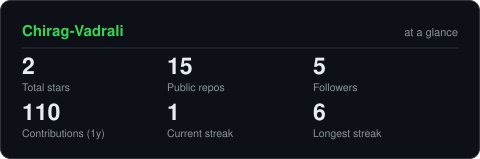
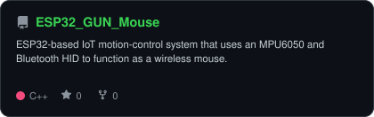
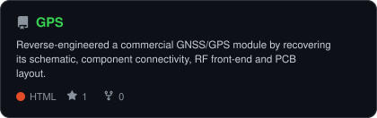
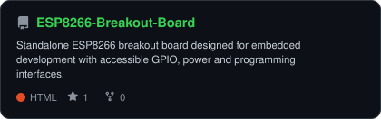
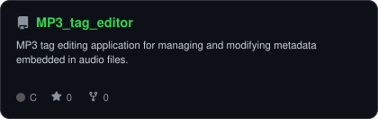

<div align="center">

<!-- PORTRAIT - generated by scripts/dotify.py from assets/me.jpg.
     Colour mode, so one file serves both GitHub themes. Regenerate with:
       python scripts/dotify.py assets/me.jpg -o assets/portrait \
         --cols 88 --equalize --detail 0.5 --circle --color --reveal -->


<br>

<!-- NAME / TAGLINE - animated typing -->
<a href="https://github.com/Chirag-Vadrali">
  
</a>

<br>

<!-- SOCIALS -->
<a href="https://www.linkedin.com/in/chiragvadrali"></a>
<a href="mailto:chiragsv18@gmail.com"></a>
<a href="https://chirag-vadrali.github.io/portfolio/"></a>
<a href="https://drive.google.com/file/d/1L53h2V-ySdhnc9yNFEFeNbL_R2Iog71h/view?usp=drive_link"></a>

<br>


<br>


</div>

---

## `~/` whoami

```console
$ cat about.txt
```

Hi, I'm **Chirag S Vadrali** — an **Electronics & Communication Engineer** passionate about hardware design, embedded systems, and continuous learning. I love bringing ideas to life through PCB layout, digital design, and programming.

- **Core Focus:** PCB Designing, Embedded Systems & Digital Design
- **Currently Improving:** Embedded C/C++ & Python programming skills
- **Career Goal:** Open to opportunities in Hardware Engineering, Embedded Systems, and VLSI/Digital Design
- **Hobbies:** Gaming | Music | Designing new concepts

> 🌐 Portfolio: **[chirag-vadrali.github.io/portfolio](https://chirag-vadrali.github.io/portfolio/)**

> 💡 Fun fact: *I started with circuits, got into coding, and somehow ended up doing both at the same time.*

<br>

<div align="center">

## `~/` toolbox


<br>

<!-- EDA tools: not on skillicons.dev, using badges -->


</div>

<br>

## 🛠️ Hardware & Systems Design Expertise
- **Hardware & Design Tools:** Altium Designer, KiCad, EasyEDA, LTspice (Schematic Design, PCB Layout, 4-Layer/Multilayer Design, DFM, DRC, Gerber Generation)
- **High-Speed & Signal Integrity:** SI/PI (Signal/Power Integrity), 50Ω Controlled Impedance, Differential Pair Routing, Return-Path Analysis, Decoupling Networks, EMC/EMI, Crosstalk Mitigation
- **Hardware Platforms & Microcontrollers:** ESP32, ESP8266, Arduino, Raspberry Pi, GNSS/NavIC GPS Module Reverse Engineering
- **Protocols & Interfaces:** SPI, I2C, UART, USB
- **Power Systems:** Li-ion BMS (Battery Management Systems), LDO Regulation, Buck Regulation, Power Delivery, Onboard Charging Circuits
- **Prototyping & Integration:** Hardware Prototyping, Hardware Debugging, System Integration, C/C++ Firmware, Sensor Fusion

---

<div align="center">

## `~/` skill radar

<!-- Self-rated radar - edit assets/skills.json, the workflow redraws it -->
<picture>
  <source media="(prefers-color-scheme: dark)"  srcset="assets/radar-dark.svg">
  <source media="(prefers-color-scheme: light)" srcset="assets/radar-light.svg">
  
</picture>

<br>

---

<!-- Live radar built from real language byte counts across your repos -->
<picture>
  <source media="(prefers-color-scheme: dark)"  srcset="assets/radar-langs-dark.svg">
  <source media="(prefers-color-scheme: light)" srcset="assets/radar-langs-light.svg">
  
</picture>

</div>

---

<div align="center">

## `~/` contribution calendar

<!-- 3D isometric calendar, regenerated every 6h by .github/workflows/metrics.yml -->


<!-- Snake eats the contribution graph - .github/workflows/snake.yml -->
<picture>
  <source media="(prefers-color-scheme: dark)"  srcset="https://raw.githubusercontent.com/Chirag-Vadrali/Chirag-Vadrali/output/snake-dark.svg">
  <source media="(prefers-color-scheme: light)" srcset="https://raw.githubusercontent.com/Chirag-Vadrali/Chirag-Vadrali/output/snake.svg">
  
</picture>

</div>

---

<div align="center">

## `~/` the numbers

<!-- Generated by scripts/cards.py into this repo. Deliberately NOT
     github-readme-stats / streak-stats / github-profile-trophy: those are
     shared public instances that go down and take the whole section with them. -->
<picture>
  <source media="(prefers-color-scheme: dark)"  srcset="assets/card-stats-dark.svg">
  <source media="(prefers-color-scheme: light)" srcset="assets/card-stats-light.svg">
  
</picture>

<br>


</div>

---

<div align="center">

## `~/` achievements & milestones

</div>

| 🏆 Achievement | Details |
|---|---|
| 🥇 **Shristi 2026 — Circuitrix** | Selected for the **Final Round** of the Circuitrix event at Shristi 2026 |
| 🤝 **FDP Volunteer — IoT Workshop** | Volunteered at the Faculty Development Programme (FDP) for teachers: *IoT Workshop* |
| 💼 **Jr. Hardware System Designer** | Ongoing internship at **VortexFlow Labs** *(incubated in BLDEACET Incubation Centre)* · **Feb 2026 → Present** |

---

<div align="center">

## `~/` selected work

<!-- Cards generated by scripts/cards.py from assets/projects.json.
     Stars, forks and language are pulled live from the API on every run. -->

<a href="https://github.com/Chirag-Vadrali/ESP32_GUN_Mouse">
  <picture>
    <source media="(prefers-color-scheme: dark)"  srcset="assets/card-ESP32_GUN_Mouse-dark.svg">
    <source media="(prefers-color-scheme: light)" srcset="assets/card-ESP32_GUN_Mouse-light.svg">
    
  </picture>
</a>

<a href="https://github.com/Chirag-Vadrali/PCB_Designs">
  <picture>
    <source media="(prefers-color-scheme: dark)"  srcset="assets/card-GPS-dark.svg">
    <source media="(prefers-color-scheme: light)" srcset="assets/card-GPS-light.svg">
    
  </picture>
</a>

<a href="https://github.com/Chirag-Vadrali/PCB_Designs">
  <picture>
    <source media="(prefers-color-scheme: dark)"  srcset="assets/card-ESP8266-Breakout-Board-dark.svg">
    <source media="(prefers-color-scheme: light)" srcset="assets/card-ESP8266-Breakout-Board-light.svg">
    
  </picture>
</a>

<a href="https://github.com/Chirag-Vadrali/MP3_tag_editor">
  <picture>
    <source media="(prefers-color-scheme: dark)"  srcset="assets/card-MP3_tag_editor-dark.svg">
    <source media="(prefers-color-scheme: light)" srcset="assets/card-MP3_tag_editor-light.svg">
    
  </picture>
</a>

</div>

---

<div align="center">

<sub>*Always learning, always building*</sub>

</div>
